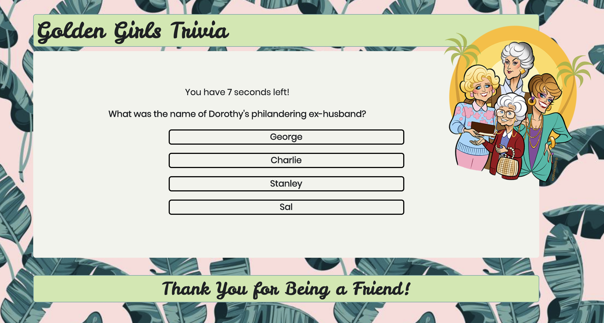

# Golden Girls Trivia

This is a front end app that uses JavaScript and jQuery timing events to create a quiz with timed questions. At the end of the quiz, the user's score is displayed. This app was created as part of UCF's Coding Bootcamp and was authored by Celisse Dones.

# Deployed App Link

<a href="https://celissed.github.io/TriviaGame/">https://celissed.github.io/TriviaGame/</a>

# Overview

Golden Girls Trivia features everybody's feisty ladies from the 80s. The app will quiz your knowledge of The Golden Girls. Each question is timed and will the user will be shown whether their selected answer is correct or incorrect. At the end of the game, the score will be shown.

# Screenshot

# Technologies Used
<ul>
    <li>HTML</li>
    <li>JavaScript/li>
    <li>jQuery</li>
    <li>Bootstrap CSS</li>
</ul>